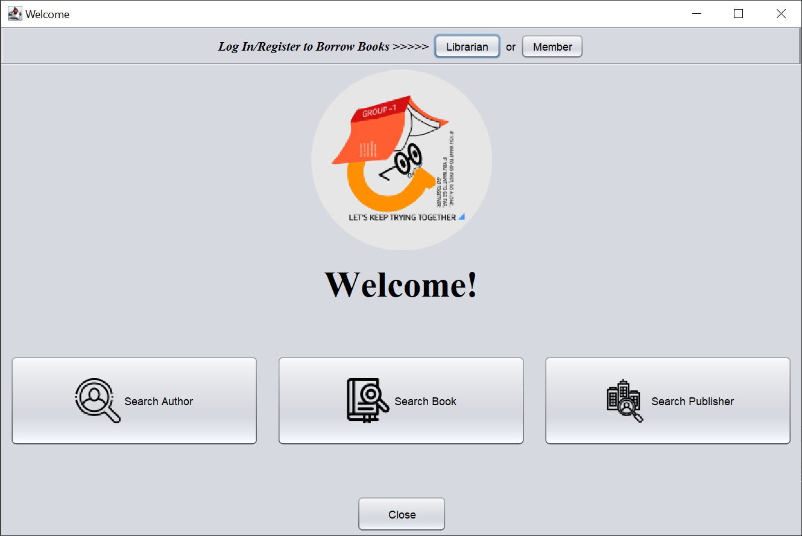
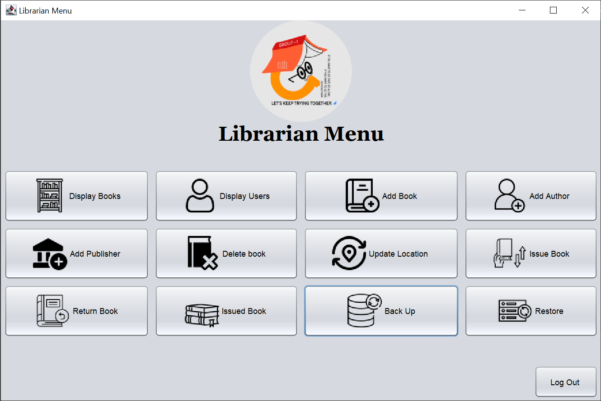
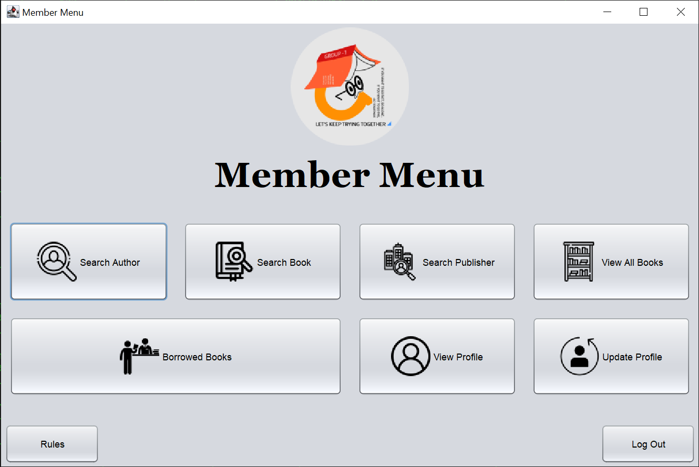
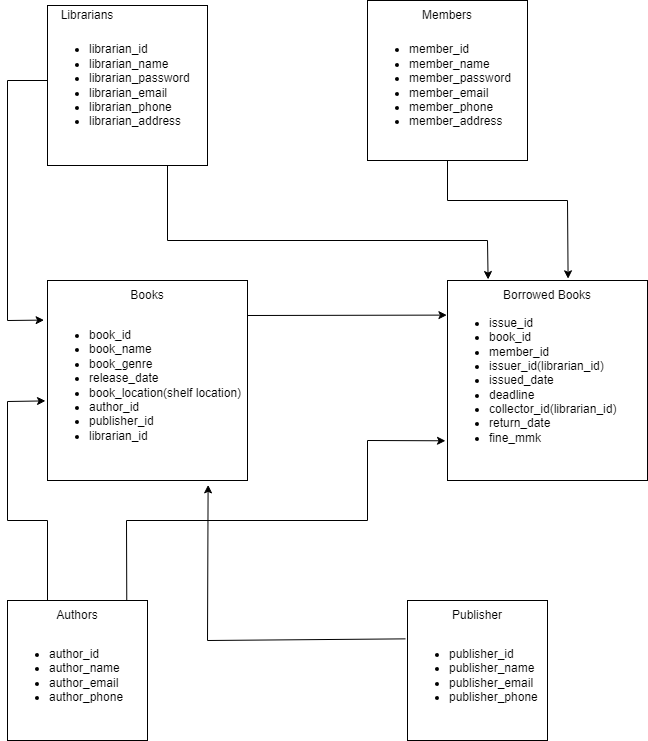

# Library Management System
This is my first Java project using Java Swing and Mysql to automate the process of the library system.

## Table of Contents
- [Introduction](#introduction)
- [Requirements](#requirements)
- [Features](#features)
- [Database](#database)
- [Usage](#usage)
- [Project Members](#project-members)
- [Disclaimer](#disclaimer)

## Introduction
The Library Management System is a project designed to efficiently manage and organize a library's resources. The system caters to two distinct roles: librarian and member. It aims to streamline the processes involved in book management, borrowing, returning, and member profile management.The Library Management System aims to improve the overall efficiency and effectiveness of library operations by providing a user-friendly interface for librarians and members.

## Requirements
Before installing and using this project, ensure that you have the following requirements in place:
- **Java Development Kit (JDK)**: Make sure you have Java JDK installed on your system. You can download it from [Oracle's website](https://www.oracle.com/java/technologies/javase-jdk11-downloads.html).
- **MySQL Database**: This project uses MySQL as the database backend. Install and set up MySQL on your system. You can download MySQL from [MySQL's official website](https://dev.mysql.com/downloads/installer/).

  > Note: During the installation process, make sure to take note of the MySQL server hostname, port number, and credentials (username and password) for configuring the project.

- **Eclipse IDE**: Install Eclipse, an integrated development environment (IDE) for Java development. You can download Eclipse from the [Eclipse website](https://www.eclipse.org/downloads/). Choose the appropriate Eclipse package for your operating system and Java development needs.

  > Note: Ensure that you have Java JDK installed before installing Eclipse, as Eclipse relies on Java to run.
  
- **JDBC Driver**: This project uses JDBC to connect to the MySQL database. Make sure you have the appropriate JDBC driver for MySQL. You can download the MySQL JDBC driver from [MySQL Connector/J](https://dev.mysql.com/downloads/connector/j/).

- **JCalendar**: This project requires an additional Java library called `JCalendar` for advanced functionality. Download the `JCalendar` JAR file from [JCalendar's Download Page](https://toedter.com/jcalendar/). Add the downloaded JAR to your project's classpath.

  > Note: Make sure to check the specific version requirements and dependencies of the `JCalendar` before downloading.

## Features

This is the preview of the Library Management System.

*Figure 1: This is the welcome page.*

*Figure 2: This is the librarian menu page.*

*Figure 3: This is the member menu page.*

## Database

  
*Relational Diagram of the Library Database*

You can download the whole database file at [resources/database](./resources/database/) and import it to your Mysql using \``Mysql Workbench`\` or \``mysql`\` command-line tools.
>Note: You can check table structure and data in [library_table_struct.sql](./library_table_struct.sql) and [library_data.sql](./library_data.sql)

## Usage
- Run `Main.java` under [src/library](./src/library/) in your IDE to start the program.

  > Note: To borrow books, you need to have a member ID.

## Project Members
- [Aung Myat Min](https://github.com/AMM1902)
- Saw Mya San Aung

## Disclaimer

The sample data included in the database of this project is randomly generated and intended for demonstration purposes only. It does not represent any real-world data or entities.

The purpose of the sample data is to showcase the functionality and features of the system. Please note that any resemblance to actual persons, organizations, or events is purely coincidental.

While efforts have been made to ensure the accuracy and validity of the sample data, there may be inconsistencies or errors. It is recommended not to rely on the sample data for any real-world analysis or decision-making.

If you intend to use this project in a production or live environment, it is essential to replace the sample data with relevant and appropriate data specific to your use case.

The project developers and contributors are not liable for any consequences arising from the use of the sample data or its interpretation.